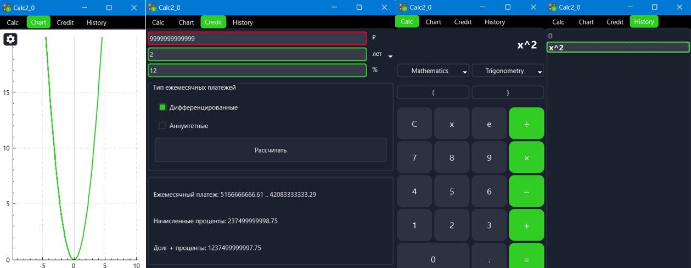

# SmartCalc

Реализация SmartCalc v2.0.

## Contents

1. [Описание](#Описание) \
    1.1. [Функции](#Функции)
2. [НачалоРаботы](#НачалоРаботы) \
3. [ФункционалКалькулятора](#ФункционалКалькулятора)\
4. [КредитныйКалькулятор](#КредитныйКалькулятор)\

## Описание
SmartCalc - это высокопроизводительный калькулятор, предназначенный для решения широкого спектра математических задач.

"UI калькулятора"

## Функции
- Базовые математические операции
- Работа с математическими и триганометрическими функциями
- Графический интерфейс пользователя
- Возможнасть отображения графиков функций
- Возможность расчета дифференцированных и аннуитетных платежей по кредиту
- История действий пользователя 

## НачалоРаботы
Для начала работы с SmartCalc клонируйте репозиторий и соберите проект с помощью следующих команд:

```bash
git clone https://repos.21-school.ru/students/CPP3_SmartCalc_v2.0.ID_353536/elishabr_student.21_school.ru/CPP3_SmartCalc_v2.0-1.git
cd CPP3_SmartCalc_v2.0-1
make install
```

## ФункционалКалькулятора 
- **Арифметические операторы**:

    | Название оператора | Инфиксная нотация <br /> (Классическая) | Префиксная нотация <br /> (Польская нотация) |  Постфиксная нотация <br /> (Обратная польская нотация) |
    | ------ | ------ | ------ | ------ |
    | Скобки | (a + b) | (+ a b) | a b + |
    | Сложение | a + b | + a b | a b + |
    | Вычитание | a - b | - a b | a b - |
    | Умножение | a * b | * a b | a b * |
    | Деление | a / b | / a b | a b \ |
    | Возведение в степень | a ^ b | ^ a b | a b ^ |
    | Остаток от деления | a mod b | mod a b | a b mod |
    | Унарный плюс | +a | +a | a+ |
    | Унарный минус | -a | -a | a- |

    >Обрати внимание, что оператор умножения содержит обязательный знак `*`.

- **Функции**:
  
        | Описание функции | Функция |   
        | ---------------- | ------- |  
        | Вычисляет косинус | cos(x) |   
        | Вычисляет синус | sin(x) |  
        | Вычисляет тангенс | tan(x) |  
        | Вычисляет арккосинус | acos(x) | 
        | Вычисляет арксинус | asin(x) | 
        | Вычисляет арктангенс | atan(x) |
        | Вычисляет квадратный корень | sqrt(x) |
        | Вычисляет натуральный логарифм | ln(x) | 
        | Вычисляет десятичный логарифм | log(x) |

## КредитныйКалькулятор

За образец  взят сайты  calcus.ru:
 - Вход: общая сумма кредита, срок, процентная ставка, тип (аннуитетный, дифференцированный);
 - Выход: ежемесячный платеж, переплата по кредиту, общая выплата.
